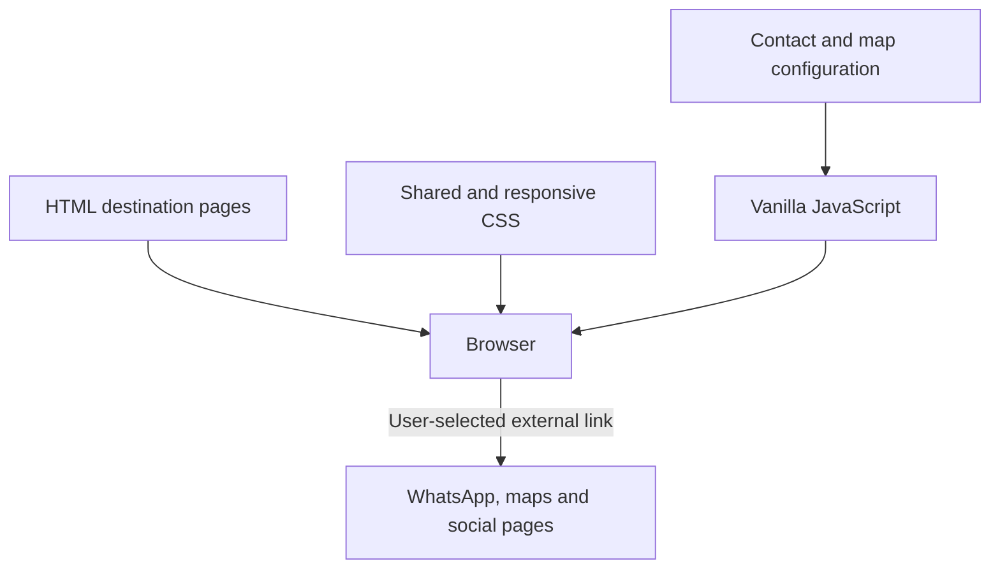

# Amerta Pertiwi — Patakbanteng Village Website

**A static information website for exploring village tourism, local services and Rumah Bibit.**

Built with HTML, CSS and vanilla JavaScript for a community-service project in Patakbanteng. The site organizes hiking information, agrotourism, local food, accommodation and visitor contacts without a server-side application.

[View the hosted prototype](https://amerta-pertiwi-v2.vercel.app/) · [Canonical repository decision](docs/REPOSITORY_STATUS.md) · [Verification](docs/VERIFICATION.md)

**Status:** public prototype. Several images/logos and official contact fields are placeholders. A working URL is not evidence that the site is approved as an official village service. Operational information, prices and contacts need partner review.

## Why this repository is the main portfolio entry

Compared with [the earlier prototype](https://github.com/aata4brian/Amerta-Pertiwi), this version has 14 HTML pages, separate responsive styles, centralized contact configuration and additional destination pages. `main` is the documented baseline. `Develop` contains a later revision that must be reviewed separately before production release; it has not been merged by this portfolio update.

## Run locally

```bash
python -m http.server 8080 --bind 127.0.0.1
```

Open [localhost:8080](http://127.0.0.1:8080). No dependency install or compilation is needed.



## Implemented interactions

- Responsive navigation and dropdowns.
- Destination filters, accordions and gallery lightbox.
- Centralized WhatsApp, map and social-link configuration.
- Contact form that opens WhatsApp when an official number is configured; it does not store or send email.
- Missing-contact fallbacks and a dedicated 404 page.

## Content and project structure

| Path | Purpose |
| --- | --- |
| `index.html` | Visitor entry points |
| `gunung-prau.html`, `basecamp.html` | Hiking and basecamp information |
| `agrowisata.html`, `rumah-bibit.html` | Agriculture and conservation |
| `jelajahi.html`, `layanan.html`, `paket.html`, `kuliner.html` | Activities, services and local businesses |
| `perjalanan.html`, `tentang.html`, `kontak.html`, `berita.html` | Access, village profile, directory and updates |
| `assets/css/` | Main styles and responsive overrides |
| `assets/js/config.js` | Official contact/map/video/social data |
| `assets/js/main.js` | Page interactions |
| `scripts/check_site.py` | Local paths, anchors and HTML baseline checks |

## Verification

```bash
python scripts/check_site.py
node --check assets/js/main.js
node --check assets/js/config.js
```

The CI workflow runs these checks without secrets or deployment. It does not validate the factual accuracy of visitor information. The repository keeps its current name and Vercel connection until release changes are approved.

## Contribution and next steps

Brian maintains this portfolio entry as part of Amerta Pertiwi. Source history consists primarily of bulk uploads and does not establish sole authorship of every visual or content item. Partner and teammate contributions should be credited when confirmed.

Priorities: review `Develop`; obtain official contacts and approved photos/logos; test mobile navigation and keyboard use; replace prototype information; then review deployment caching and release versioning. The repository currently sets long-lived caching on unversioned assets, which should be reviewed before a production content update.

No project license has been selected. Existing assets and partner marks must not be assumed freely reusable. See [asset requests](ASSET_REQUESTS.md).
